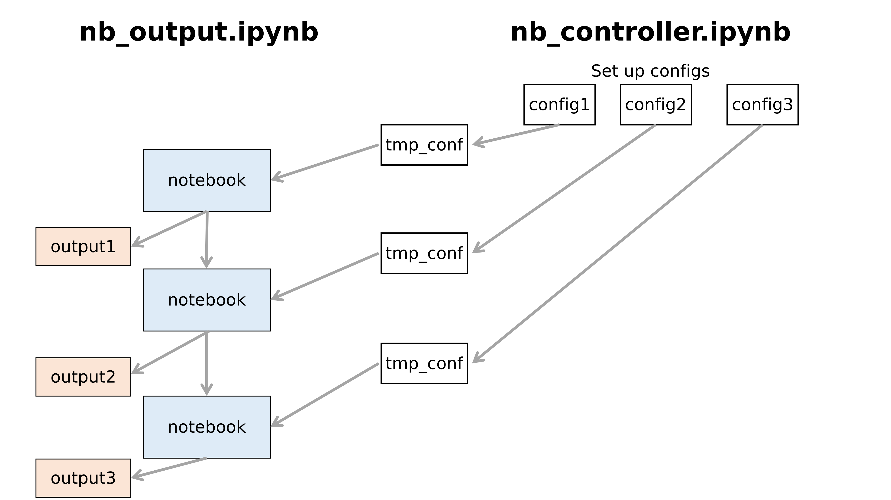
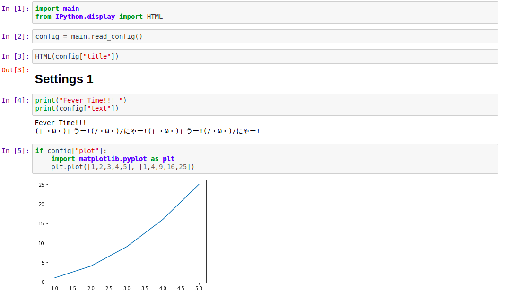
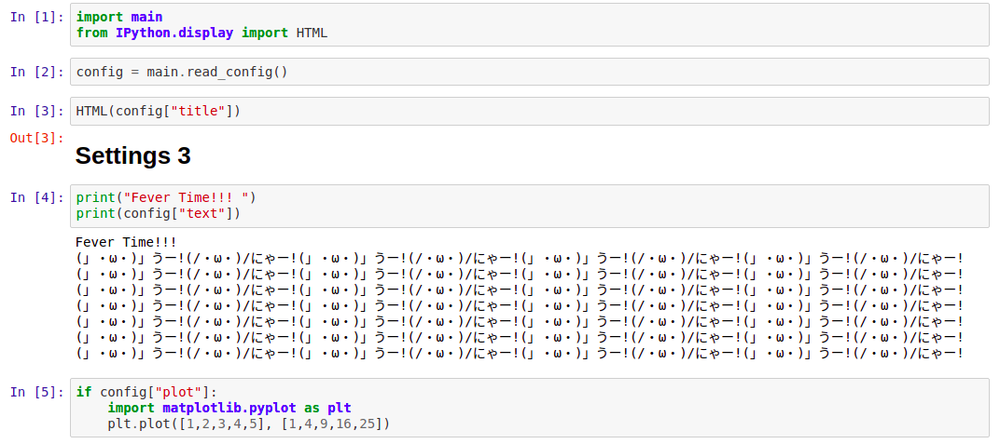
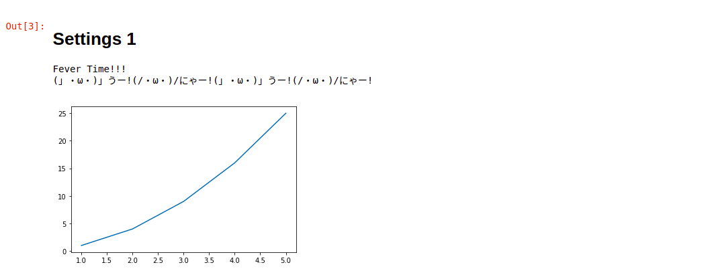
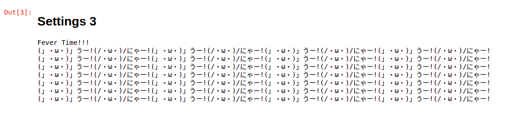

# many_pynb
Output various version of python jupyter notebook from one notebook with different settings.

# Installation 
```
pip install many_pynb
```

# Architecture
Idea of many_pynb is to run a single notebook with different configs. 
output notebook (nb_output.ipynb) can only indicate the same name of a file, 
so that file name and replace it with different configs. 
We can achive various types of jupyter notebook output. 




# Usage
Prepare two notebooks. One is for control, the other is for output.

For illustration purpose, nb_controller.ipynb is for a control notebook,   
and nb_output.ipynb is for a output notebook. 


### controller notebook
In nb_controller.ipynb, you should prepare configs that type is json. 
Also specify target file. 

```python
import many_pynb  
setteings = many_pynb.setup(target_file, config_paths)
```
and output becomes. 

```
# many_pynb settings
- target file : nb_output.ipynb
- config files :
    ./configs/config0.json
    ./configs/config1.json
    ./configs/config2.json
    ./configs/config3.json
    ./configs/config4.json
- output files:
    ./many_pynb_output/nb_output_0.html
    ./many_pynb_output/nb_output_1.html
    ./many_pynb_output/nb_output_2.html
    ./many_pynb_output/nb_output_3.html
    ./many_pynb_output/nb_output_4.html
```
If you do not specify output_dir, `manby_pynb_output` directory is created.  
If you do not specify each file name, target_file with numbering is used for each notebook.  

### output notebook
You just read a config by 
```python
import many_pynb
config = many_pynb.read_config()
```

and the config variable contains information as a dictionary type.  
Then, use this information, you can change code results. 

**Note** : first, you should set up configs and run `many_pynb.setup` and `many_pynb.run`,  
and `tmp_many_pynb_config.json` is created. many_pynb use this file for loading each config.  
Then, after creating this file, you can adjust output notebook interactively 
using `many_pynb.read_config`.

# Sample output

Using example code, the following output can be obtained.

***


*** 


***

Text as markdown can also be adjusted using `IPython.display.HTML`.  

with `exclude_code_block` option to be True for `many_pynb.run`,  
html output without code block is obtained.

***


***


***

